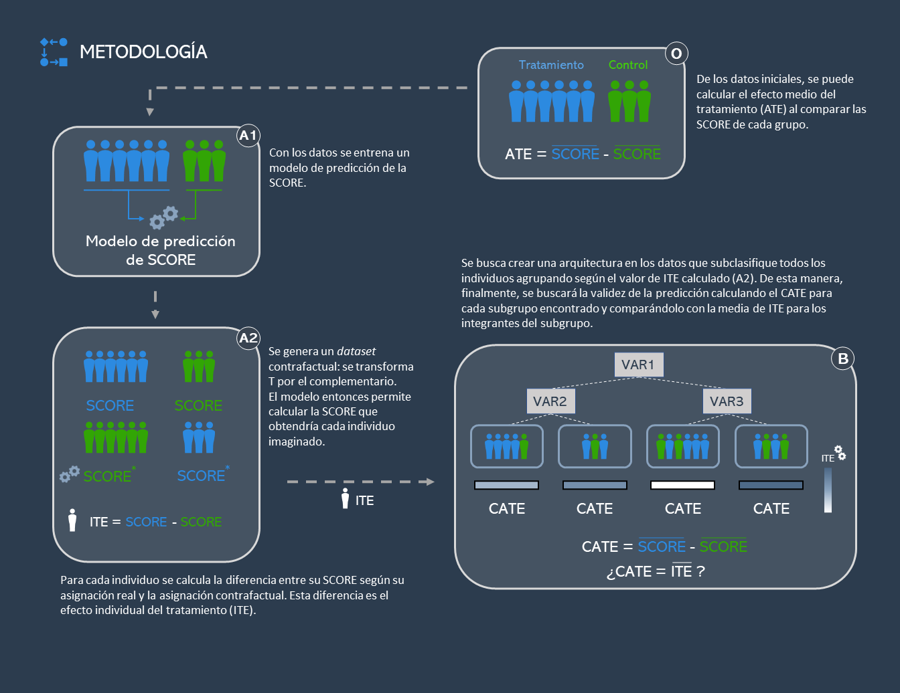
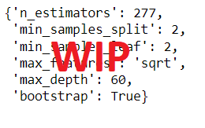
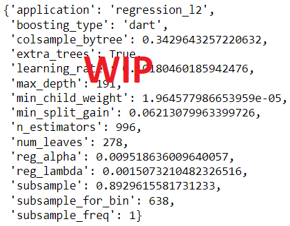
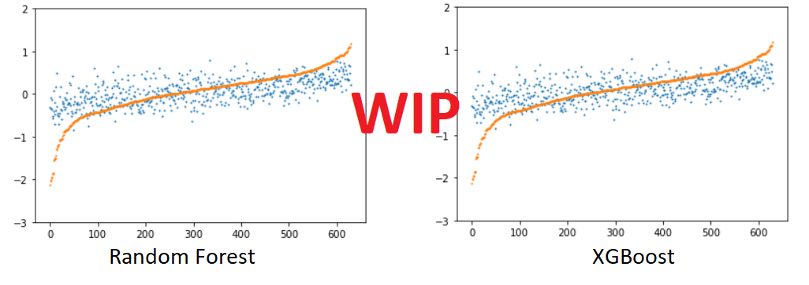
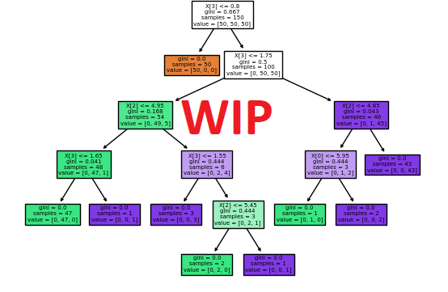

# Cash Transfers and Cognitive Development: Predicción y análisis

## Índice
1.	Resumen
2.	Introducción    
    2.1.	Programa *Atención a Crisis*    
    2.2.	Metodología del estudio    
3.	*Capstone project*: Motivación y objetivos
4.	Exploración preliminar de datos
5.	Metodología y análisis    
    5.1.	Marco teórico: *Potential Outcomes* e *Individual Treatment Effect*    
    5.2.    Implementación        
6.	Resultados    
    6.1. Interpretación    
    6.2. Validez del método    
7.	Limitaciones    
    7.1.   *Causal Forest*    
    7.2.   Implementación    
9.	Conclusión
10.	Bibliografía

## 1. Resumen

[...]

## 2.	Introducción

El desarrollo en los primeros años de vida es un predictor importante del éxito a lo largo de la vida. Tanto en países desarrollados como en vías de desarrollo, los niños con un nivel de desarrollo cognitivo menor antes de entrar al sistema educativo tienen un peor desempeño escolar y obtienen un nivel salarial más bajo (Currie and Thomas 2001; Case and Paxson 2008). En este contexto, diseñar política pública que sea capaz de reducir los niveles de subdesarrollo de los niños debería ser una prioridad, ya que no solamente tiene efectos en el bienestar actual de los infantes sino también en su futuro y el de su comunidad.

A pesar de la importancia de asegurar un desarrollo cognitivo y físico saludable entre los más pequeños, los recursos económicos de los cuales disponen los gobiernos son limitados. Esta problemática es particularmente relevante para los países en vías de desarrollo. Para garantizar un mayor nivel de eficiencia y equidad no solamente es relevante saber si dicha política pública es efectiva, sino también el efecto que tiene para grupos con diferentes características. De esta forma es posible identificar los individuos que se verían más beneficiados de recibir una ayuda pública y los grupos a los cuales es más urgente ayudar para garantizar un mayor nivel de equidad.

###     2.1.	Programa *Atención a Crisis*

###     2.2.	Metodología del estudio

El artículo “Cash Transfers, Behavioral Changes,and Cognitive Development in Early Childhood: Evidence from a Randomized Experiment” (Macours, 2012) supone una primera aproximación para evaluar los efectos de *Atención a Crisis*. El objetivo de los autores de este estudio es determinar el efecto de ser tratado sobre el desarrollo cognitivo y físico. De este modo, lo que se pretende estimar es la diferencia en el desarrollo entre los individuos que han recibido la compensación económica (tratamiento) *versus* otros individuos con característica similares que no (control).

La metodología aplicada en el artículo estima el efecto causal de ser beneficiario de *Atención a Crisis* mediante un simple análisis de regresión del tipo:

  

Donde:    
Yi = Puntuación en términos de desarrollo cognitivo y físico.  
Ti = Variable binaria que igual a 1 para los individuos que han recibido la ayuda de *Atención a Crisis* (tratados) e igual a 0 del contrario (control).  
Xi = Vector de k regresores para controlar por características de los individuos.  
ui = Resto de características no incluidas en el modelo que también pueden tener efecto sobre la variable Yi (por ej. Factores genéticos).  

El diseño experimental de *Atención a Crisis* implica una serie de características que facilitan la estimación del efecto causal de ser tratado mediante el análisis de regresión. En primer lugar, asignar los individuos a grupos de tratamiento o de control de forma aleatoria, como si de una lotería se tratase, supone que no existe correlación entre ser tratado y otras características no observadas de los individuos,  es decir, E(ui│Ti )=0. Al cumplirse esta propiedad se puede asumir que el coeficiente estimado &beta;1 no esta sesgado y representa de forma acurada el verdadero valor poblacional de recibir el tratamiento. En segundo lugar, los individuos de la muestra forman parte de una misma población y han sido seleccionados de forma aleatoria, implicando que los estimadores de mínimos cuadrados ordinarios (MCO) son consistentes. 

Ambas propiedades permiten a los autores interpretar el coeficiente de &beta;1 como el efecto causal medio de ser tratado *versus* no ser tratado. Este efecto se conoce en la literatura como *Average Treatment Effect* (ATE) y representa la diferencia de medias entre el grupo de tratamiento y control:

  

Donde:    
Y1 = Puntuación media de los individuos tratados.    
Y0
 = Puntuación media de los individuos no tratados.    

Los resultados del estudio muestran que el ATE=0.0876, significativo a un nivel de significación del 99%. Teniendo en cuenta que Yi está medida como una unidad tipificada (*z-score*), con media 0 y desviación estándar de 1, podemos concluir que el beneficio medio de recibir *Atención a Crisis* es un incremento del 8.76% de desviaciones estándares en el desarrollo cognitivo y físico.

El objetivo de este articulo no es predictivo ya que simplemente pretende estimar el efecto causal de recibir la compensación económica. Dado el diseño del programa dicho efecto podría calcularse simplemente con una regresión simple incluyendo la variable tratamiento (Ti) y un intercepto (&beta;i). De hecho, el vector de variables de control Xki simplemente se incluye para controlar las diferencias existentes entre los grupos de control y tratamiento debidas a un número de observaciones relativamente bajo. Por este motivo no resulta especialmente relevante obtener unas medidas de ajuste como el R2.

## 3.	*Capstone project*: Motivación y objetivos

El ATE resulta muy útil para estimar la eficacia media de un tratamiento, pero no nos informa del efecto que el tratamiento tiene para cada individuo. Podría ser que el efecto del tratamiento difiriera significativamente entre grupos con diferentes características, haciendo que el ATE sea en realidad poco informativo. Es más, de existir estas diferencias, sería interesante poder crear un modelo que permita capturar la heterogeneidad en la respuesta al tratamiento, indicando a qué grupos de la población se debería focalizar la política pública. 

## 4.	Exploración preliminar de datos

El *dataset* bruto cuenta con 4511 registros de 198 variables de las cuales 25 son variables de respuesta (*outcome*) correspondientes a distintas medidas del desarrollo de los niños (puntuaciones de tests como el Test de Vocabulario en Imágenes de Peabody). 

Después analizar el significado de las variables de entrada disponibles y estudiar la metodología y estructura del estudio, se realiza una selección inicial de variables basada en el conocimiento previo sobre sus potenciales efectos sobre las variables resultado (es decir, se seleccionan las variables que se consideran más implicadas en el desarrollo cognitivo de los niños). Seguidamente, se realiza una exploración más detallada de los datos seleccionados (para más información, consúltese el cuaderno [01_DATA_EXPLORATION](01_DATA_EXPLORATION.ipynb)).

En primer lugar, se estudia la presencia y distribución de datos faltantes para decidir una estrategia de gestión. Existe un alto número de datos faltantes para los *outcomes* debido a que el individuo en cuestión no cumplía el límite de edad para la realización de los tests. Por este motivo se decide filtrar los registros con una edad demasiado pequeña en el momento de iniciar el tratamiento (*age_transfer* < -11). Para resolver el resto de datos faltantes en las vairables independientes, se observa que ciertas variables corresponden a información que potencialmente pertenece a toda la unidad familiar (como los años de educación de la madre), por lo que se hipotetiza que en otros registros que pertenezcan a la misma unidad familiar (según el identificador *hogarid_old*) aparecerá la información faltante. De esta manera, se podrán imputar según la media o la moda (para variables cuantitativas y categóricas, respectivamente) dentro de la misma unidad familiar. Finalmente, el resto de datos faltantes se imputarán por mediana y moda.

Por último, algunas variables presentan valores atípicos, por lo que se deciden filtrar según si sobrepasan un límite de tres veces el rango intercuartílico por debajo o encima del primer y tercer cuartiles, respectivamente. Las variables contínuas, una vez filtradas por atípicos, serán reescaladas mediante una estandarización o normalización en función de la normalidad de su distribución.

El resultado final del procesado de los datos es la implementación de una *pipeline* (disponible en [02_DATA_CLEANING](02_DATA_CLEANING.ipynb)) que sigue el siguiente esquema:

## 5.	Metodología y análisis

El método que se propone busca calcular el efecto del tratamiento a nivel individual mediante un modelo predictivo de la variable de respuesta *z_all_06*, como medida del desarrollo infantil. Una vez calculado, se realiza una estratificación de la muestra según su valor, de manera que se agrupen los individuos con un efecto del tratamiento similar. El siguiente diagrama resume el procedimiento explicado en detalle en las siguientes secciones.

### 5.1.   Marco teórico: *Potential Outcomes* e *Individual Treatment Effect*

En la tradición de los *potential outcomes*, un efecto causal se define como la comparación entre dos estados del mundo. El primer estado del mundo es el que se conoce como el actual y es el mundo tal y como lo observamos (por ejemplo, el individuo i recibe la ayuda de *Atención a Crisis*). El segundo estado del mundo es el que llamamos contrafactual (el mismo individuo i no recibe la ayuda de *Atención a Crisis*). De acuerdo con esta tradición de pensamiento, el efecto causal de recibir la ayuda de *Atención a Crisis* es la diferencia en el desarrollo cognitivo y físico entre los dos estados del mundo:

  

Donde:    
&delta;i=El efecto del tratamiento para el individuo i, *Individual Treatment Effect* (ITE)    
Yi1=Resultado del individuo i en el estado del mundo donde ha recibido el tratamiento.    
Yi0=Resultado del individuo i en el estado del mundo donde no ha recibido el tratamiento.    

La complejidad a la hora de estimar &delta;i es que el resultado en el mundo contrafactual no se observa. Sin embargo, el uso de modelos de *Machine Learning* bien entrenados podría predecir la variable *outcome* (Yi) para el estado del mundo contrafactual. Para ello, se genera una copia del conjunto de datos en la que se modifica la variable tratamiento por su valor complementario, de modo que:    

  

Debido a las pocas observaciones disponibles en el dataset (N=3141) hemos decidido aplicar un modelo de regresión múltiple y un modelo de *extreme gradient boosting*. Paralelamente, hemos aplicado un modelo de *Random Decision Tree* (RDT) siguiendo la metodología aplicada en (Lamont et al., 2016). Mediante el modelo que presente una mayor tasa de acierto en la predicción pretendemos estimar el contrafactual de cada individuo, obteniendo de esta forma &delta;i.    
 
Capturar el efecto individual del tratamiento (ITE) nos permite distinguir entre aquellos individuos (y sus características) para los cuales el efecto del tratamiento ha sido (o hubiera sido) más beneficioso y aquellos para los cuales el efecto es nulo o incluso negativo. Llegados a este punto, se prentende estratificar en función del ITE y crear subgrupos para identificar los grupos de población con mejor y peor respuesta al tratamiento.

Para la agrupación se utiliza un *Decision Tree* que hace split minimiza el MSE de manra que se estratifica por ITE. Con este procedimiento conseguiremos un conjunto de subgrupos con un ITE similar por cada subgrupo, pero distinto entre subgrupos.

###     5.2. Implementación

Como se ha explicado previamente, para estimar el ITE, se han explorado diversos modelos de predicción basados en la elección de modelos delineada en el apartado anterior. Sobre el *dataset* procesado y separado en *train* y *test*, se entrenan los distintos modelos. Únicamente se usan aquellas variables independientes que previamente se han seleccionado en la exploración de datos y únicamente la variable dependiente *z_all_06*. Para la estimación de la bondad de ajuste se utiliza el R2 y un *Root Mean Squared Error* (RMSE), aplicando una  validación cruzada de 10 iteraciones (*10-fold cross-validation*). 

Inicialmente se entrenaron los modelos sin hacer optimización de sus hiperparámetros para comprobar la utilidad de base de los modelos. Los resultados obtenidos son los siguientes:

- La regresión lineal simple proporciona una R2 de 17.41 % y un RMSE de 0.471.
- El modelo *Random Forest* con 20 estimadores proporciona un R2 de 26.39 % y un RMSE de 0.442, mejor que la regresión lineal.
- Finalmente, el *XGBoost* proporciona un R2 de 15.77 %, siendo el modelo con peor bondad de ajuste de todos. El RMSE es de 0.474, el más alto de los modelos. Esto no sorprende, puesto que sin optimizar los hiperparámetros la complejidad del modelo es demasiado alta para un *dataset* tan pequeño.
   
A continuación, se optimizan los hiperparámetros para los modelos *Random Forest* y *XGBoost* (para la regresión lineal no es necesario), usando un *Randomized Grid Search*.

- Para el *Random Forest*, los hiperparámetros optimizados son los siguientes:

    
El nuevo modelo *Random Forest* con los hiperparámetros optimizados obtiene un R2 de 31.80 % y un RMSE de 0.434, claramente superior al *Random Forest* base.

- Para el *XGBoost*, los hiperparámetros optimizados son los siguientes:

    
El *XGBoost* optimizado proporciona un R2 de 32.35 % y un RMSE de 0.431. Por lo tanto, se concluye que este es el mejor modelo comparado con el resto.

Para seguir analizando los modelos se realiza una visualización de sus respectivas curvas de aprendizaje.

    
A pesar de que las curvas convergen con mayor rapidez utilizando la regresión lineal, el *XGBoost* presenta unos valores de error más bajos y un cierto nivel de convergencia entre las curvas del *train* y del *test*.

A continuación se muestra, también, un *scatterplot* para comparar los resultados:

    
<ins> Cálculo de los valores de ITE </ins>

El primer paso para estimar el ITE es generar el contrafactual de cada individuo. Mediante el modelo *XGboost* entrenado anteriormente se podrá predecir el *outcome* (*z_all_06*) para cada contrafactual. Llegados a este punto, se dispone del estado actual y del estado contrafactual de cada individuo, obteniendo así toda la información necesaria para calcular el ITE. El último paso simplemente consiste en calcular la diferencia de resultados entre el Yi1 (la puntuación cuando el individuo i recibe el tratamiento) y Yi0 (cuando el individuo i no recibe el tratamiento).

Así, se obtiene un *dataframe* con el ITE para cada individuo. <ins><strong>La distribución de los ITE sigue una distribución aproximadamente normal con una media en 0.09. Probablemente este es el primer resultado interesante del estudio. Tal y como se ha mencionado anteriormente, E(ITE)=E(δi )=ATE, indicando que el ATE estimado mediante nuestro modelo es de 0.09, muy similar y dentro del intervalo de confianza del resultado obtenido por (Macours et al., 2012). Dada la consistencia y ausencia de sesgo del ATE en regresión simple, podemos asumir que nuestros estimadores son insesgados. </strong> </ins> 

<ins> Estratificación por ITE </ins>

El punto final para la implementación del método es el entrenamiento de un *Decision Tree* sobre el *dataset* con el ITE calculado como variable de respuesta. [...]

El resultado es: [...]

Las variables seleccionadas por este modelo para las agrupaciones son:

[tabla de variables y significado]

## 6.	Resultados
### 6.1.   Interpretación

El *Decision Tree* obtenido clasifica en primera instancia según la variable BLABLABLABLA que podría ser por BLABLABLABLA.

### 6.2.   Validez del método

## 7.   Limitaciones

*z_all_06*
En primer lugar, centrar el análisis en el individuo y no en un subgrupo más amplio puede crear problemas de multiplicidad, es decir, de falsos positivos (Lamont et al., 2016). En segundo lugar, la base de datos contiene muchas variables que pueden tener un buen poder predictivo pero con significados complejos (por ej. efecto en el desarrollo del % de indiviuos vacunados en la comunidad). Dadas estas características de la base de datos parece razonable pensar que crear clusters sin una previa selección de variables acabaría creando unos resultados difíciles de interpretar.  

BUSCANDO INFO ENCONTRAMOS EL CAUSAL TREE ASÍ QUE SE APLICA PARA VER QUÉ OFRECE

### 7.1.   *Causal Tree*

La intuición detrás de este método, propuesto por Susan Athey (Athey et al., 2019), es similar a un *Decision Tree*. Sin embargo, en este caso el criterio a optimizar cuando se dividen los nodos no es minimizar el error en la predicción sino maximizar la diferencia de ATE en cada subgrupo que se crea. 

Para ser más precisos, el árbol calculado reportará un conjunto de subgrupos con diferentes ATEs, condicionado a sus características. Este concepto se define como el CATE (*Conditional Average Treatment Effect*):

  

Tal y como se puede observar, el *Causal Tree* no necesita el cálculo de los ITE para conseguir los subgrupos y sus CATEs, solamente necesita individuos tratados y controles en cada subgrupo que se crea. La principal ventaja de esto es que permite utilizar los datos observacionales evitando posibles errores de estimación producidos al calcular los ITE.

### 7.2.   Implementación

## 7.	Conclusión
## 8.	Bibliografía

