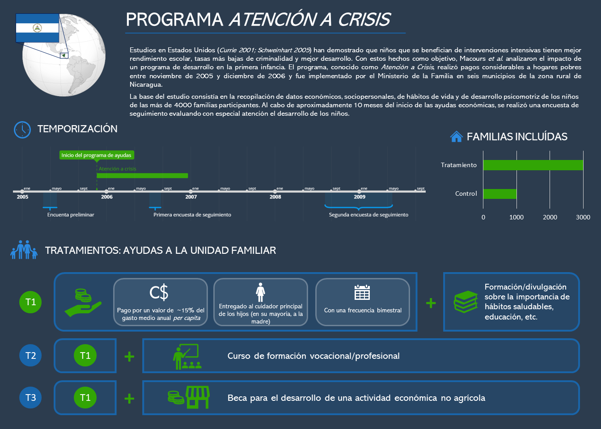
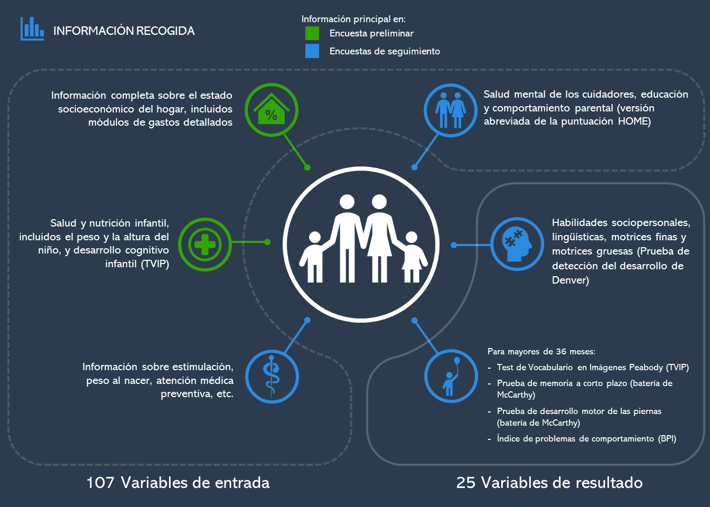
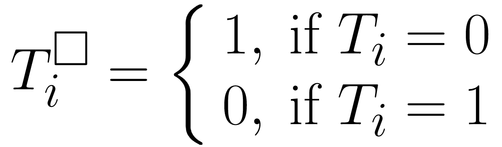
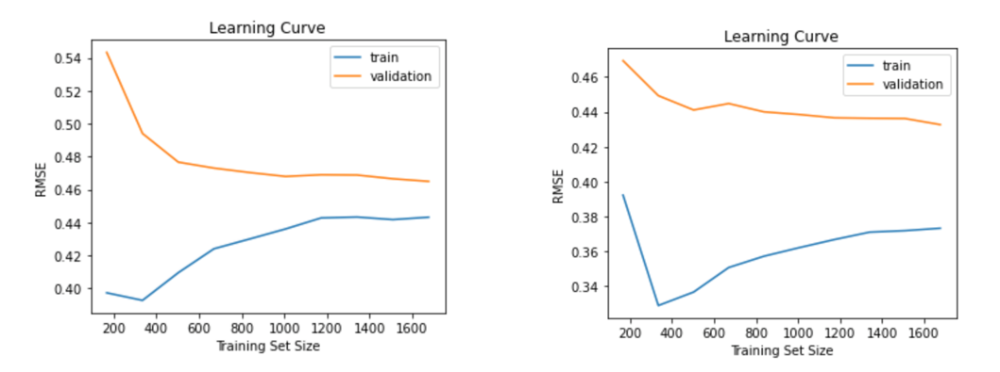

# Cash Transfers and Cognitive Development: Predicción y análisis

## Índice
1.	Resumen
2.	Introducción    
    2.1.	Programa Atención a Crisis    
    2.2.	Metodología del estudio    
3.	*Capstone project*: Motivación y objetivos
4.	Exploración preliminar de datos
5.	Metodología y análisis    
    5.1.	Primer enfoque: predicción del efecto causal    
    5.2.    Cálculo de ITE: modelos de predicción    
    5.3.	Segundo enfoque: estimación de efecto condicional    
    5.4.    Cálculo de CATE: honest causal forest    
6.	Comparación
7.	Conclusión
8.	Bibliografía

## 1. Resumen

[...]

## 2.	Introducción

El desarrollo en los primeros años de vida es un predictor importante del éxito a lo largo de la vida. Tanto en países desarrollados como en desarrollo, los niños con un nivel de desarrollo cognitivo menor antes de entrar al sistema educativo tienen un peor desempeño escolar y obtienen un nivel salarial más bajo (Currie and Thomas 2001; Case and Paxson 2008). En este contexto, diseñar política pública que sea capaz de reducir los niveles de subdesarrollo de los niños debería ser una prioridad, ya que no solamente tiene efectos en el bienestar actual de los infantes sino también en su futuro y el de su comunidad.

A pesar de la importancia de asegurar un desarrollo cognitivo y físico saludable entre los más pequeños, los recursos económicos de los cuales disponen los gobiernos son limitados. Esta problemática es particularmente relevante para los países en desarrollo. Para garantizar un mayor nivel de eficiencia y equidad no solamente es relevante saber si dicha política pública es efectiva, sino también el efecto que tiene para grupos con diferentes características. De esta forma es posible identificar los individuos que se verían más beneficiados de recibir una ayuda pública (mayor eficiencia) y los grupos a los cuales es más urgente ayudar para garantizar un mayor nivel de equidad.

###     2.1.	Programa *Atención a Crisis*

###     2.2.	Metodología del estudio

El artículo “Cash Transfers, Behavioral Changes,and Cognitive Development in Early Childhood: Evidence from a Randomized Experiment” (Macours 2012) supone una primera aproximación para evaluar los efectos de *Atención a Crisis*. El objetivo de los autores de este estudio es determinar el efecto de ser tratado sobre el desarrollo cognitivo y físico. De este modo, lo que se pretende estimar es la diferencia en el desarrollo entre los individuos que han recibido la compensación económica (tratamiento) *versus* otros individuos con característica similares que no (control). 

La metodología aplicada en el artículo estima el efecto causal de ser beneficiario de Atención a Crisis mediante un simple análisis de regresión del tipo:

 Yi = &beta;0 + &beta;1Ti + &beta;kXki + ui

Donde:    
Yi=Puntuación en términos de desarrollo cognitivo y físico.  
Ti=Variable binaria que igual a 1 para los individuos que han recibido la ayuda de Atención a Crisis (tratados) e igual a 0 del contrario (control).  
Xki= Vector de k regresores para controlar por características de los individuos.  
ui= Resto de características no incluidas en el modelo que también pueden tener efecto sobre la variable Yi (por ej. Factores genéticos).  

El diseño experimental de Atanción a Crisis implica una serie de características que facilitan la estimación del efecto causal de ser tratado mediante el análisis de regresión. En primer lugar, asignar los individuos a grupos de tratamiento o de control de forma aleatoria, como si de una lotería se tratase, supone que no existe correlación entre ser tratado y otras características no observadas de los individuos. Esto es, E(u_i│T_i )=0. Al cumplirse esta propiedad se puede asumir que el coeficiente estimado β_1 no esta sesgado y representa de forma acurada el verdadero valor poblacional de recibir el tratamiento. En segundo lugar, los individuos de la muestra forman parte de una misma población y han sido seleccionados de forma aleatoria, implicando que los estimadores de mínimos cuadrados ordinarios (MCO) son consistentes. 

Ambas propiedades permiten a los autores interpretar el coeficiente de β1 como el efecto causal medio de ser tratado versus no ser tratado. Este efecto se conoce en la literatura como Average Treatment Effect (ATE) y representa la diferencia de medias entre el grupo de tratamiento y control:

 ATE=Y1-Y0 

Donde:    
Y1=Puntuación media de los individuos tratados.    
Y0=Puntuación media de los individuos no tratados.    

Los resultados del estudio muestran que el ATE=0.0876, significante a un nivel de significación del 99%. Teniendo en cuenta que Yi está mesurada en un z-score, con media 0 i desviación estándar de 1, podemos concluir que el beneficio medio de recibir Atención a Crisis es un incremento del 8.76% desviaciones estándares en el desarrollo cognitivo y físico.

El objetivo de este articulo no es predictivo ya que simplemente pretende estimar el efecto causal de recibir la compensación económica. Dado el diseño del programa dicho efecto podría calcularse simplemente con una regresión simple incluyendo la variable tratamiento (Ti) y un intercepto (&beta;i). De hecho, el vector de variables de control Xki simplemente se incluye para controlar las diferencias existentes entre los grupos de control y tratamiento debidas a un número de observaciones relativamente bajo. Por este motivo no resulta especialmente relevante obtener unas medidas de ajuste como el R2. A pesar de ello hemos decidido replicar el análisis realizado por los autores (siguiendo las indicaciones metodológicas y de tratamiento de datos mencionados en el artículo) para obtener las principales medidas de bondad de ajuste de los modelos de regresión y que nos sirvan como base sobre la cual sofisticar nuestro análisis. La media del error de estimación al cuadrado es de  y el R2 es de 0.17.

## 3.	*Capstone project*: Motivación y objetivos

El ATE resulta muy útil para estimar la eficacia media de un tratamiento, pero no nos informa del efecto que el tratamiento tiene para cada individuo. Podría ser que el efecto del tratamiento fuese difiriera significativamente entre grupos con diferentes características, haciendo que el ATE sea en realidad poco informativo. Es más, de existir estas diferencias, sería interesante poder crear un modelo que permita capturar la heterogeneidad en la respuesta al tratamiento, indicando a qué grupos de la población se debería focalizar la política pública. 

## 4.	Exploración preliminar de datos

El *dataset* cuenta con 4511 registros

## 5.	Estrategia de identificación

Esquema Chema.
### 5.1.   "Potential Outcomes" e "Individual Treatment Effect"

En la tradición de los “potential outcomes”, un efecto causal se define como la comparación entre dos estados del mundo. El primer estado del mundo es el que se conoce como el actual y es el mundo tal y como lo observamos (por ejemplo, el individuo i recibe la ayuda de Atención a Crisis). El segundo estado del mundo es el que llamamos contrafactual (el mismo individuo i no recibe la ayuda de Atención a Crisis). De acuerdo con esta tradición de pensamiento, el efecto causal de recibir la ayuda de Atención a Crisis es la diferencia en el desarrollo cognitivo y físico entre los dos estados del mundo:

 &delta;i=Yi1-Yi0 

Donde:    
&delta;i=El efecto del tratamiento para el individuo i, Individual Treatment Effect (ITE)    
Yi1=Resultado del individuo i en el estado del mundo donde ha recibido el tratamiento.    
Yi0=Resultado del individuo i en el estado del mundo donde no ha recibido el tratamiento.    

Destacar que el ATE no es otra cosa que la media de &delta;i.

La complejidad a la hora de estimar &delta;i es que el resultado en el mundo contrafactual no se observa. Sin embargo, el uso de modelos de Machine Learning bien entrenados podría predecir la variable outcome (Yi) para el estado del mundo contrafactual. Para ello, se genera una copia del conjunto de datos en la que se modifica la variable tratamiento (Ti□) por su valor complementario, de modo que:    
      
 
    
Debido a las pocas observaciones con disponibles en el dataset (N=3141) hemos decidido aplicar un modelo de regresión múltiple y un modelo de “extreme gradient boosting”. Paralelamente, hemos aplicado un modelo de Random Decision Tree (RDT) siguiendo la metodología aplicada en (Lamont et al., 2016). Mediante el modelo que presente una mayor tasa de acierto en la predicción pretendemos estimar el contrafactual de cada individuo, obteniendo de esta forma &delta;i.    
 
Capturar el efecto del tratamiento individual (ITE) nos permite distinguir entre aquellos individuos (y sus características) por los cuales el efecto del tratamiento ha sido (o hubiera sido) más beneficioso y aquellos por los cuales el efecto es nulo o incluso negativo. Llegados a este punto, parecería relativamente senzillo estratificar en función del ITE y crear clusters para identificar los grupos de población con mejor y peor respuesta al tratamiento.    

Sin embargo exiten una serie de pronlemáticas que nos hacen dudar de este enfoque. En primer lugar, centrar el análisis en el individuo y no en un subgrupo más amplio puede crear problemas de multiplicidad, es decir, de falsos positivos (Lamont et al., 2016). En segundo lugar, la base de datos contiene muchas variables que pueden tener un buen poder predictivo pero con significados complejos (por ej. efecto en el desarrollo del % de indiviuos vacunados en la comunidad). Dadas estas características de la base de datos parece razonable pensar que crear clusters sin una previa selección de variables acabaría creando unos resultados difíciles de interpretar.    
    
### 5.2.   Causal Forest

EL método que utilizaremos para encontrar las variables que determinan el éxito del tratamiento es el Causal Forest, propuesto por (Athey et al., 2019). La intuición detrás de los Causal Forest es similar a los Random Forest. Sin embargo, en este caso el criterio a optimizar cuando se dividen los árboles no es minimizar el error en la predicción sino maximizar la diferencia de ATE en cada subgrupo que se crea. 

Para ser más precisos, cada árbol calculado mediante el Causal Forest reportarà un conjunto de subgrupos con diferentes ATEs, condicionado a sus características. Este concepto se define como el CATE (Conditional Average Treatment Effect):

 CATE=E(Yi1-Yi0│Xi=x)=Yi1 (x)-Yi0 (x) 

Tal y como se puede observar, el Causal Forest no necesita de los ITE para calcular los CATEs, solamente individuos tratados y controles en cada subgrupo que se crea. La principal ventaja de esto es que nos permite utilizar los datos observacionales para estimar el Causal Forest. De este modo, obtendremos las variables de interés directamente de las observaciones reales librandonos de posibles errores de estimación producidos al calcular los ITE.

Dicho esto, un Causal Forest está formado por un conjunto de Causal Trees. Cada Causal Tree selecciona de forma aleatoria un conjunto reducido de variables y observaciones, calcula los CATEs con el criterio de optimización mencionado anteriormente. El resultado del Causal Forest será el conjunto de variables que a lo largo de todos los Causal Forest maximizan las diferencias de CATEs entre subgrupos. 

###     5.3.    Obtención de los subgrupos

Llegados a este punto, por un lado tenemos el efecto del tratamiento para cada individuo (ITE) y por otro tenemos el conjunto de variables más relevantes para explicar la heterogenenidad en la respuesta al tratamiento. (acabar demà)

###     5.4. Obtención de resultados

####    5.4.1. Cálculo de ITE: modelos de predicción

Como se ha explicado previamente, para estimar el ITE, hemos creado diversos modelos de predicción basándonos en nuestra elección de modelos delineada en el apartado anterior. Aplicamos a los datos previamente limpiados y separados en train y test a los modelos distintos. Usamos únicamente aquellas variables independientes que hemos seleccionado previamente y únicamente la variable dependiente “z_all_06”. Para la estimación de goodness-of-fit utilizamos el R2 y un Root Mean Squared Error (RMSE), aplicando un Cross-Validation de 10 folds para los datos de validación. 

Inicialmente aplicamos los modelos sin hacer optimización de hiperparámetros para comprobar la utilidad de los modelos de base. Los resultados obtenidos son los siguientes:

- La regresión lineal simple nos da una R2 de 17.41%y un RMSE de 0.471.
- Con el modelo Random Forest con 20 estimadores (Decision Trees) obtenemos un R2 de 26.39%, con un RMSE de 0.442, mejor que la regresión lineal.
- El XGBoost proporciona un R2 de 15.77% , siendo el modelo con peor goodness-of-fit de todos. El RMSE es de 0.474, el más alto de los modelos. Esto no nos sorprende, puesto que sin optimizar los hiperparámetros la complejidad del modelo es demasiado alta para un dataset tan pequeño.
   
    

A continuación, optimizamos los hiperparámetros para los modelos de Random Forest y XGBoost (para la regresión lineal no hace falta), usando un Randomized Search.

- Para el Random Forest, los hiperparámetros optimizados son los siguientes:

Nuestro nuevo Random Forest con los hiperparámetros optimizados obtiene un R2 de 31.80% y con un RMSE de 0.434, claramente superior al Random Forest base.

- Para el XGBoost, los hiperparámetros optimizados son los siguientes:
XXXX    
El XGBoost optimizado nos da unR2 de 32.35% y un RMSE de 0.431. Por lo tanto, concluímos que este es el mejor modelo comparado con el resto.

Para seguir analizando los modelos realizamos una visualización de las Learning Curves.

A pesar de que las learning curves convergen con mayor rapidez utilizando la regresión lineal, el XGBoost presenta unos valores de error más bajos y un cierto nivel de convergencia entre las curvas del train y del test.

Comparamos el resultado, también, con un scatterplot:

- Linear Regression
XXXX

- XGBoost
XXXX

Calculando valores de ITE

El primer paso para estimar el ITE es generar el contrafactual de cada individuo. Mediante el modelo XGboost entrenado anteriormente predecimos el outcome (z_all_06) para cada contrafactual. Llegados a este punto, ya tenemos el estado actual y el estado contrafactual de cada individuo, obteniendo toda la información necesaria para calcular el ITE. El último paso simplemente consiste en calcular la diferencia de resultados entre el Yi1 (cuando el individuo i recibe el tratamiento) y Yi0 (cuando el individuo i no recibe el tratamiento).

Así, obtenemos un dataframe con todos los ITEs para cada individuo. La distribución de los ITE tiene una distribución aproximadamente normal con una media en 0.09. Probablemente este es el primer resultado interesante del estudio. Tal y como se ha mencionado anteriormente, E(ITE)=E(δi )=ATE, indicando que el ATE estimado mediante nuestro modelo es de 0.09, muy similar y dentro del intervalo de confianza del resultado obtenido por (Macours et al., 2012). Dada la consistencia y ausencia de sesgo del ATE en regresión simple, podemos asumir que nuestros estimadores son insesgados. 

####    5.4.2.	Cálculo de CATE: honest causal forest

####    5.4.3.	Cálculo de subgrupos
## 6.	Comparación
## 7.	Conclusión
## 8.	Bibliografía

