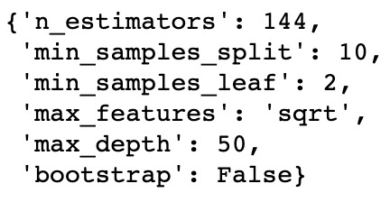
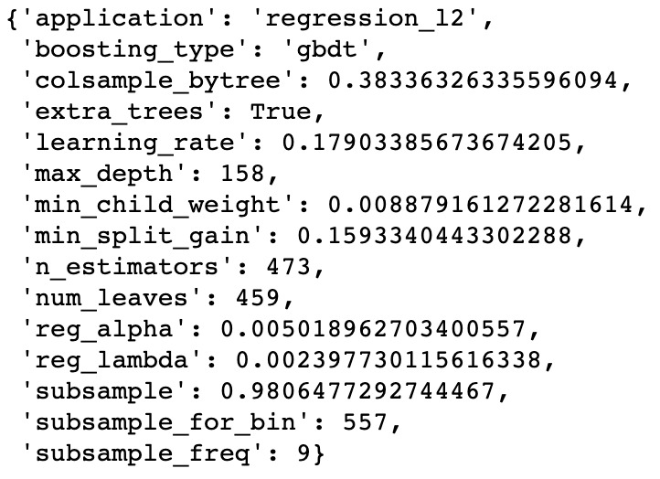
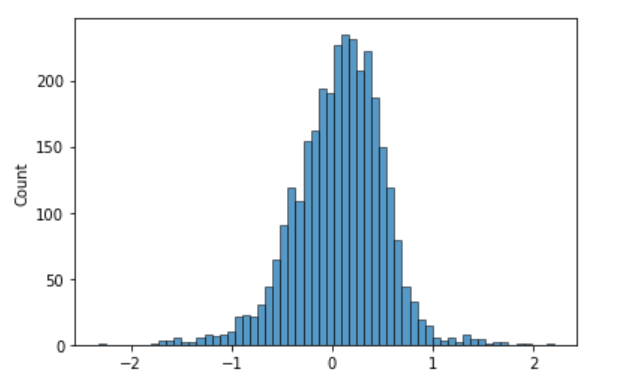
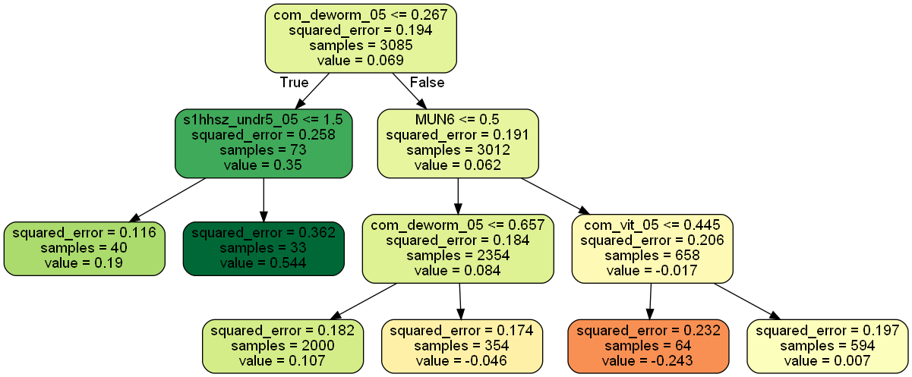
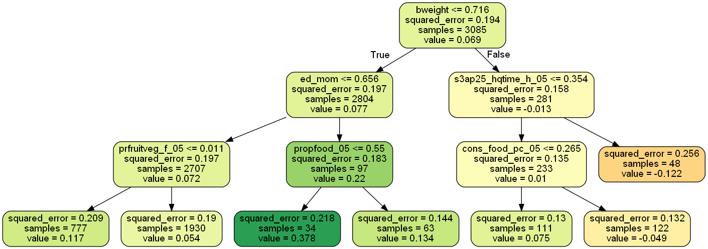
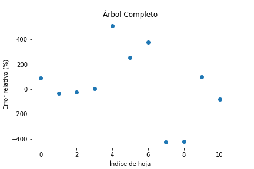
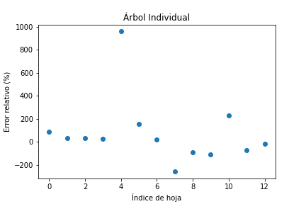
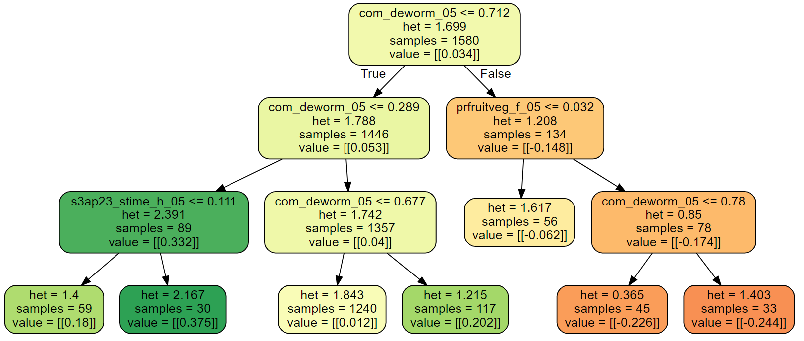

# Cash Transfers and Cognitive Development: Predicción y análisis

## Índice
1.	Resumen
2.	Introducción    
    2.1.	Programa *Atención a Crisis*    
    2.2.	Metodología del estudio    
3.	*Capstone project*: Motivación y objetivos
4.	Exploración preliminar de datos
5.	Metodología y análisis    
    5.1.	Marco teórico: *Potential Outcomes* e *Individual Treatment Effect*    
    5.2.    Implementación        
6.	Resultados    
    6.1. Interpretación    
    6.2. Validez del método    
7.	Limitaciones    
    7.1.   *Causal Forest*       
9.	Conclusión
10.	Bibliografía
 

## 1. Resumen
Durante los años 2005 y 2008 se llevó a cabo un programa de ayudas monetarias en Nicaragua llamado *Atención a Crisis*. En un artículo de 2012, Macours et al.  estudiaron el efecto medio de recibir la ayuda (*Average Treatment Effect* - ATE). 

El trabajo que se presenta a continuación pretende ampliar las conclusiones de Macours et al. calculando el efecto del tratamiento por diferentes subgrupos de la población, con el objetivo de poder aplicar políticas económicas de forma más personalizada a cada subgrupo. La metodología que se lleva a cabo es estimar los efectos de tratamiento para cada individuo (comúnmente conocido como *Individual Treatment Effect* - ITE) mediante modelos de Machine Learning para posteriormente estudiar las características que determinan mayor o menor éxito del tratamiento.

## 2.	Introducción

El desarrollo en los primeros años de vida es un predictor importante del éxito a lo largo de la vida. Tanto en países desarrollados como en vías de desarrollo, los niños con un nivel de desarrollo cognitivo menor antes de entrar al sistema educativo tienen un peor desempeño escolar y obtienen un nivel salarial más bajo (Currie and Thomas 2001; Case and Paxson 2008). En este contexto, diseñar política pública que sea capaz de reducir los niveles de subdesarrollo de los niños debería ser una prioridad, ya que no solamente tiene efectos en el bienestar actual de los infantes sino también en su futuro y el de su comunidad.

A pesar de la importancia de asegurar un desarrollo cognitivo y físico saludable entre los más pequeños, los recursos económicos de los cuales disponen los gobiernos son limitados. Esta problemática es particularmente relevante para los países en vías de desarrollo. Para garantizar un mayor nivel de eficiencia y equidad no solamente es relevante saber si dicha política pública es efectiva, sino también el efecto que tiene para grupos con diferentes características. De esta forma es posible identificar los individuos que se verían más beneficiados de recibir una ayuda pública y los grupos a los cuales es más urgente ayudar para garantizar un mayor nivel de equidad.

###     2.1.	Programa *Atención a Crisis*

###     2.2.	Metodología del estudio

El artículo “Cash Transfers, Behavioral Changes,and Cognitive Development in Early Childhood: Evidence from a Randomized Experiment” (Macours, 2012) supone una primera aproximación para evaluar los efectos de *Atención a Crisis*. El objetivo de los autores de este estudio es determinar el efecto del tratamiento sobre el desarrollo cognitivo y físico. De este modo, lo que se pretende estimar es la diferencia en el desarrollo entre los individuos que han recibido la compensación económica (tratamiento) *versus* otros individuos con característica similares que no la recibieran (control).

La metodología aplicada en el artículo estima el efecto causal de ser beneficiario de *Atención a Crisis* mediante un simple análisis de regresión del tipo:

  

Donde:    
Yi = Puntuación en términos de desarrollo cognitivo y físico.  
Ti = Variable binaria que equivale a 1 para los individuos que han recibido la ayuda de *Atención a Crisis* y a 0, por el contrario (control).  
Xi = Vector de k regresores para controlar por características de los individuos.  
ui = Resto de características no incluidas en el modelo que también pueden tener efecto sobre la variable Yi (por ej. Factores genéticos).  

El diseño experimental de *Atención a Crisis* implica una serie de características que facilitan la estimación del efecto causal de ser tratado mediante el análisis de regresión. En primer lugar, asignar los individuos a grupos de tratamiento o de control de forma aleatoria, como si de una lotería se tratase, supone que no existe correlación entre ser tratado y otras características no observadas de los individuos,  es decir, E(ui│Ti )=0. Al cumplirse esta propiedad se puede asumir que el coeficiente estimado &beta;1 no está sesgado y representa de forma acertada el verdadero valor poblacional de recibir el tratamiento. En segundo lugar, los individuos de la muestra forman parte de una misma población y han sido seleccionados de forma aleatoria, implicando que los estimadores de mínimos cuadrados ordinarios (MCO) son consistentes. 

Ambas propiedades permiten a los autores interpretar el coeficiente &beta;1 como el efecto causal medio de ser tratado *versus* no ser tratado. Este efecto se conoce en la literatura como *Average Treatment Effect* (ATE) y representa la diferencia de medias entre el grupo de tratamiento y control:

  

Donde:    
Y1 = Puntuación media de los individuos tratados.    
Y0
 = Puntuación media de los individuos no tratados.    

Los resultados del estudio muestran que el ATE=0.0876, significativo a un nivel de significación del 99%. Teniendo en cuenta que Yi está medida como una unidad tipificada (*z-score*), con media 0 y desviación estándar de 1, podemos concluir que el beneficio medio de recibir *Atención a Crisis* es un incremento del 8.76% de desviaciones estándares en el desarrollo cognitivo y físico.

El objetivo de este articulo no es predictivo ya que simplemente pretende estimar el efecto causal de recibir la compensación económica. Dado el diseño del programa dicho efecto podría calcularse simplemente con una regresión simple incluyendo la variable tratamiento (Ti) y un intercepto (&beta;i). De hecho, el vector de variables de control Xki simplemente se incluye para controlar las diferencias existentes entre los grupos de control y tratamiento debidas a un número de observaciones relativamente bajo. Por este motivo no resulta especialmente relevante obtener unas medidas de ajuste como el R2.

## 3.	*Capstone project*: Motivación y objetivos

El ATE resulta muy útil para estimar la eficacia media de un tratamiento, pero no nos informa del efecto que el tratamiento tiene para cada individuo. Podría ser que el efecto del tratamiento difiriera significativamente entre grupos con diferentes características, haciendo que el ATE sea en realidad poco informativo. Es más, de existir estas diferencias, sería interesante poder crear un modelo que permita capturar la heterogeneidad en la respuesta al tratamiento, indicando a qué grupos de la población se debería focalizar la política pública. 

Por ello, este proyecto busca seguir una metodología que identifique las diferencias en la respuesta al tratamiento dentro de la población y, consecuentemente, crear subgrupos que permitan optimizar el programa de ayudas económicas.

## 4.	Exploración preliminar de datos

Para estudiar la heterogeneidad en la respuesta al tratamiento se realiza una exploración incial del conjunto de datos, en previsión del entrenamiento de modelos predictivos sobre las variables de respuesta. El *dataset* bruto cuenta con 4511 registros de 198 variables, de las cuales 25 son variables de respuesta (*outcome*) correspondientes a distintas medidas del desarrollo de los niños (puntuaciones de tests como el Test de Vocabulario en Imágenes de Peabody). 

Después de analizar el significado de las variables de entrada disponibles y estudiar la metodología y estructura del estudio, se realiza una selección inicial de variables basada en el conocimiento previo sobre sus potenciales efectos sobre las variables resultado (es decir, se seleccionan las variables que se consideran más implicadas en el desarrollo cognitivo de los niños). Seguidamente, se realiza una exploración más detallada de los datos seleccionados (para más información, consúltese el cuaderno [01_DATA_EXPLORATION](01_DATA_EXPLORATION.ipynb)).

En primer lugar, se estudia la presencia y distribución de datos faltantes para decidir una estrategia de gestión. Existe un alto número de datos faltantes para los *outcomes* debido a que el individuo en cuestión no cumplía el límite de edad para la realización de los tests. Por este motivo se decide filtrar los registros con una edad demasiado pequeña en el momento de iniciar el tratamiento (*age_transfer* < -11). Para resolver el resto de datos faltantes en las variables independientes, se observa que ciertas variables corresponden a información que potencialmente pertenece a toda la unidad familiar (como los años de educación de la madre), por lo que se hipotetiza que en otros registros que pertenezcan a la misma unidad familiar (según el identificador *hogarid_old*) aparecerá la información faltante. De esta manera, se podrán imputar según la media o la moda (para variables cuantitativas y categóricas, respectivamente) dentro de la misma unidad familiar. Finalmente, el resto de datos faltantes se imputarán por mediana y moda.

Por último, algunas variables presentan valores atípicos, por lo que se deciden filtrar según si sobrepasan un límite de tres veces el rango intercuartílico por debajo o encima del primer y tercer cuartiles, respectivamente. Las variables contínuas, una vez filtradas por atípicos, serán reescaladas mediante una estandarización o normalización en función de la normalidad de su distribución.

El resultado final del procesado de los datos es la implementación de una *pipeline* (disponible en [02_DATA_CLEANING](02_DATA_CLEANING.ipynb)) que sigue el siguiente esquema:

## 5.	Metodología y análisis

El método que se propone busca calcular el efecto del tratamiento a nivel individual mediante un modelo predictivo de la variable de respuesta *z_all_06*, como medida del desarrollo infantil. Una vez calculado, se realiza una estratificación de la muestra según su valor, de manera que se agrupen los individuos con un efecto del tratamiento similar. El siguiente diagrama resume el procedimiento explicado en detalle en las siguientes secciones.

### 5.1.   Marco teórico: *Potential Outcomes* e *Individual Treatment Effect*

En la tradición de los *potential outcomes*, un efecto causal se define como la comparación entre dos estados del mundo. El primer estado del mundo es el que se conoce como el actual y es el mundo tal y como lo observamos (por ejemplo, el individuo i recibe la ayuda de *Atención a Crisis*). El segundo estado del mundo es el que llamamos contrafactual (el mismo individuo i no recibe la ayuda de *Atención a Crisis*). De acuerdo con esta tradición de pensamiento, el efecto causal de recibir la ayuda de *Atención a Crisis* es la diferencia en el desarrollo cognitivo y físico entre los dos estados del mundo:

  

Donde:    
&delta;i = Efecto del tratamiento para el individuo i, *Individual Treatment Effect* (ITE)    
Yi1 = Resultado del individuo i en el estado del mundo donde ha recibido el tratamiento.    
Yi0 = Resultado del individuo i en el estado del mundo donde no ha recibido el tratamiento.    

La complejidad a la hora de estimar &delta;i es que el resultado en el mundo contrafactual no se observa. Sin embargo, el uso de modelos de *Machine Learning* bien entrenados podría predecir la variable *outcome* (Yi) para el estado del mundo contrafactual. Para ello, se genera una copia del conjunto de datos en la que se modifica la variable tratamiento por su valor complementario, de modo que:    

  

Debido a las pocas observaciones disponibles en el dataset (N=3141), se ha decidido aplicar un modelo de regresión múltiple y un modelo de *extreme gradient boosting*. Paralelamente, hemos aplicado un modelo de *Random Decision Tree* (RDT) siguiendo la metodología aplicada en (Lamont et al., 2016). Mediante el modelo que presente una mayor tasa de acierto en la predicción se pretende estimar el contrafactual de cada individuo, obteniendo de esta forma &delta;i.    
 
Capturar el efecto individual del tratamiento (ITE) permite distinguir entre aquellos individuos (y sus características) para los cuales el efecto del tratamiento ha sido (o hubiera sido) más beneficioso y aquellos para los cuales el efecto es nulo o incluso negativo. Llegados a este punto, se prentende estratificar en función del ITE y crear subgrupos para identificar los grupos de población con mejor y peor respuesta al tratamiento.

Para la agrupación se utiliza un *Decision Tree*, de manera que subdivida los registros estratificando por ITE. Con este procedimiento se conseguirá un conjunto de subgrupos con un ITE similar por cada subgrupo, pero distinto entre ellos.

Finalmente, como una *a priori* sencilla comprovación de la validez conceptual del método, se propone calcular el efecto del tratamiento condicionado condicionado a las características de cada subgrupo. Este concepto se define como el CATE (*Conditional Average Treatment Effect*):

  

Es decir, dentro de cada subgrupo se computará diferencia entre la media de la variable respuesta para los individuos tratados (Yi1(X)) y para los no tratados (Yi0(X)). De esta forma, si la estratificación por ITE captura una heterogeneidad real en los datos respecto al efecto del tratamiento, la media de ITE dentro de cada subgrupo debería ser comparable a su respectivo CATE.

###     5.2. Implementación

Como se ha explicado previamente, para estimar el ITE, se han explorado diversos modelos de predicción basados en la elección de modelos delineada en el apartado anterior. Sobre el *dataset* procesado y separado en *train* y *test*, se entrenan los distintos modelos (proceso disponible en [03_ITE_MODEL](03_ITE_MODEL.ipynb)). Únicamente se usan aquellas variables independientes que previamente se han seleccionado en la exploración de datos y únicamente la variable dependiente *z_all_06*. Para la estimación de la bondad de ajuste se utiliza el R2 y un *Root Mean Squared Error* (RMSE), aplicando una  validación cruzada de 10 iteraciones (*10-fold cross-validation*). 

Inicialmente se entrenaron los modelos sin hacer optimización de sus hiperparámetros para comprobar la utilidad de base de los modelos. Los resultados obtenidos son los siguientes:

- La regresión lineal simple proporciona una R2 de 16.57 % y un RMSE de 0.464.
- El modelo *Random Forest* con 20 estimadores proporciona un R2 de 25.62 % y un RMSE de 0.443, mejor que la regresión lineal.
- Finalmente, el *LightGBM* proporciona un R2 de 11.46 %, siendo el modelo con peor bondad de ajuste de todos. El RMSE es de 0.476, el más alto de los modelos. Esto no sorprende, puesto que sin optimizar los hiperparámetros la complejidad del modelo es demasiado alta para un *dataset* tan pequeño.
   
A continuación, se optimizan los hiperparámetros para los modelos *Random Forest* y *LightGBM* (para la regresión lineal no es necesario), usando un *Randomized Grid Search*.

- Para el *Random Forest*, los hiperparámetros optimizados son los siguientes:

    
El nuevo modelo *Random Forest* con los hiperparámetros optimizados obtiene un R2 de 32.69 % y un RMSE de 0.433, claramente superior al *Random Forest* base.

- Para el *LightGBM*, los hiperparámetros optimizados son los siguientes:

    
El *LightGBM* optimizado proporciona un R2 de 32.34 % y un RMSE de 0.431. Por lo tanto, se concluye que este es el mejor modelo comparado con el resto.

Para seguir analizando los modelos se realiza una visualización de sus respectivas curvas de aprendizaje.

    
    
    

A pesar de que las curvas convergen con mayor rapidez utilizando la regresión lineal, el *LightGBM* presenta unos valores de error más bajos y un cierto nivel de convergencia entre las curvas del *train* y del *test*.

A continuación se muestra, también, un *scatterplot* para comparar los resultados:

    

   
Se puede observar que en el gráfico del *Random Forest* se revela un *overfitting* durante el entrenamiento del modelo donde incluso los valores extremos se predicen con poco error. En cambio, se observa que el modelo *LightGBM* no se ajusta de forma tan extrema.

Considerando esta visualización y la previa visualización de las curvas de aprendizaje, y pese a que el modelo *Random Forest* haya tenido un mayor R2 y un RMSE parecido al *LightGBM*, se ha escogido el modelo de *LightGBM* para realizar las predicciones de los valores contrafactuales.

  
<ins> Cálculo de los valores de ITE </ins>

El primer paso para estimar el ITE es generar el contrafactual de cada individuo. Mediante el modelo *LightGBM* entrenado anteriormente se podrá predecir el *outcome* (*z_all_06*) para cada contrafactual. Llegados a este punto, se dispone del estado actual y del estado contrafactual de cada individuo, obteniendo así toda la información necesaria para calcular el ITE. El último paso simplemente consiste en calcular la diferencia de resultados entre el Yi1 (la puntuación cuando el individuo i recibe el tratamiento) y Yi0 (cuando el individuo i no recibe el tratamiento). Así, se obtiene un *dataframe* con el ITE para cada individuo. 

    

En el histograma anterior se puede observar que la distribución de los ITEs es aproximadamente normal con media muy cercana al 0, concretamente de 0.068. Teniendo  en cuenta que la media del ITE debería coincidir con el ATE,  el efecto del tratamiento esta siendo ligeramente subestimado si lo comparaos con el ATE estimado por (Macours, 2012), que es de 0.0875.

 

     
<ins> Estratificación por ITE </ins>

El punto final para la implementación del método es el entrenamiento de un *Decision Tree* sobre el *dataset* con el ITE calculado como variable de respuesta. En el cuaderno [04_DECISION_TREE](04_DECISION_TREE.ipynb) se expone el procedimiento en detalle. Para una mejor visualización del árbol, con la estratificación de ITE como objetivo, se establece una escala de color con el intervalo (-0.5, 0.5).

El *Decision Tree* entrenado tiene una profundidad máxima de 3 y un valor mínimo de 30 individuos por hoja. Con estos parámetros, se ha obtenido el siguiente árbol:

Según esta estructura, las variables que permiten subclasificar la población según el efecto del tratamiento son las siguientes:

| Variable        |   | Significado                                           |
|-----------------|---|-------------------------------------------------------|
| com_deworm_05   |   | % de niños con medicación antiparasitaria             |
| com_vit_05      |   | % de niños que han recibido vitaminas en la comunidad |
| s1hhsz_undr5_05 |   | núm de individuos con <5 años en la unidad familiar   |
| MUN6            |   | variable *dummy* que indentifica a un municipio       |

Puesto que algunas estas variables pertenecen a variables comunitarias (como *com_dewom_05*), se decide entrenar un segundo árbol que sólo incluya variables de naturaleza individual/familiar como propuesta para identificar mejor la naturaleza de la heterogeneidad a nivel individual. Este segundo árbol, entrenado con los mismos parámetros, tiene las siguientes estructura y variables:

    
| Variable           |   | Significado                                  |
|--------------------|---|----------------------------------------------|
| bweight            |   | peso al nacer                                |
| ed_mom             |   | años de educación de la madre                |
| prfruitveg_f_05    |   | % de frutas y verduras en el gasto en comida |
| cons_food_pc_05    |   | gasto total en comida (*per capita*)         |
| propfood_05        |   | % de comida en el gasto total                |
| s3ap25_hqtime_h_05 |   | tiempo (en h) hasta la sede municipal        |

## 6.	Resultados
### 6.1.   Interpretación

El primer Decision Tree aplicado sobre los resultados del ITE usa todas las variables utilizadas para la estimación del ITE presentado anteriormente. El primer resultado a destacar es la relevancia de las variables comunitarias para explicar el éxito del tratamiento en los individuos.

Tal y como se puede observar, la primera particion del árbol se explican a través de la variable com_deworm_05, es decir el porcentaje de niños que han recibido medicina antiparasitaria. A pesar de que esta variable tiene un significado muy concreto, es razonable pensar que en realidad es un proxy de otras características de la comunidad. Por ejemplo, es posible que las comunidades con un menor porcentaje de niños medicados estén más lejos de los centros hospitalarios, tengan menos acceso a la información y dispongan de un menor nivel de renta que impide costear el viaje a centros hospitalarios y/o a los medicamentos antiparasitarios.
Mediante las dos particiones en la variable com_deworm_05 se pueden identificar dos tipos de comunidades donde el efecto del tratamiento es muy heterogéneo.

- Comunidades donde menos del 26.7% de los niños han recibido la medicación antiparasitaria. -> Efecto positivo de 35% desviaciones estándares en el desarrollo de los niños.
- Comunidades con una tasa de medicación superior el 26.7%. ->Efecto positivo del tratamiento, pero próximo a 0.

Parece bastante claro que comunidades con menor tasa de niños con medicación antiparasitaria, probablemente aquellas más empobrecidas y con menos recursos, son las más beneficiadas de recibir el tratamiento. Entre este subgrupo, el efecto del tratamiento es especialmente elevado para aquellos hogares con más de un infante. Des de la óptica de la política pública la primera recomendación, acorde con los resultados de nuestro modelo, seria focalizar los esfuerzos económicos en esas comunidades más humildes y con más de un hijo en el hogar, ya que en estas el impacto del tratamiento se maximiza. 

Para las comunidades con mayor tasa de medicación el Decision Tree hace una partición en función de si el individuo vive o no en el municipio 6. Parece ser que si el individuo forma parte del municipio 6 y forma parte de una comunidad con altos niveles de medicación antiparasitaria el efecto del tratamiento es muy pequeño, incluso negativo. Para los individuos que no viven en el municipio 6 el efecto del tratamiento es positivo, especialmente para el subgrupo de individuos que forma parte de comunidades con un porcentaje de niños medicados con antiparasitarios menor al 65.7% (y mayor al 26.7%). Otra vez, estos resultados parecen apuntar a que las comunidades más humildes son aquellas que más se benefician de recibir el tratamiento.

En este primer árbol, creado usando todas las variables disponibles, la importancia de las variables relacionadas con la comunidad es aplastante. En algunos casos, como es el caso de la variable municipio 6, los resultados son poco intuitivos y difíciles de interpretar. Por este motivo, tal y como hemos comentado anteriormente, vamos a realizar otro estudio incluyendo solamente variables de características individuales. 

  
 
El primer resultado relevante es que existen diferencias a la respuesta al tratamiento en función del peso al nacer del individuo. De acuerdo con los resultados del modelo, el subgrupo con un mayor peso al nacer obtiene peores resultados al tratamiento. Una posible interpretación defendería que un peso al nacer reducido es indicativo de un estado de salud más frágil que se podría beneficiar especialmente de una ayuda económica que proporcione mejor alimentación y/o atención sanitaria. No obstante, hay que tener en cuenta que esta hipótesis asume una serie de causalidades sin tener en cuenta importantes características no observables como factores genéticos. 

Para el subgrupo de menor peso, el *Decision Tree* genera una subsecuente partición en función de los años de educación que ha recibido la madre, de forma que el subgrupo cuyas madres recibieron mayor educación se benefician especialmente de Atención a Crisis. Este resultado puede ir en línea con el hecho que la ayuda se pagara mayoritariamente a las madres: posiblemente, quienes tuvieran mayor educación supieran aprovechar mejor la oportunidad y/o beneficiarse más de los cursos de formación/divulgación. Sería interesante evaluar si, en el supuesto que tanto padres como madres fueran receptores del pago a partes iguales, los años de educación del padre también presentasen este efecto.

Siguiendo la estructura del árbol por esta rama, se proponen dos particiones más en función de dos variables relacionadas con el gasto en alimentos. Por un lado, según si el porcentaje de gasto total en alimentos es inferior a un 55%, se obtiene el subgrupo con el mayor efecto percibido por el tratamiento. A este subgrupo pertenecen los individuos con un menor peso al nacer, cuyas madres han recibido mayor educación y gastan menos en comida. Intuitivamente estos individuos pueden beneficiarse especialmente del tratamiento por sinergia de las hipótesis anteriores.

Por otro lado, se hace una partición en función del porcentaje que suponen frutas y verduras dentro del gasto total en alimentos. No obstante, la partición se hace cuando éste es menor de un 1%, valor que se intuye ser poco representativo de una diferencia real.

Finalmente, cabe destacar que una partición importante se realiza sobre la variable *s3ap25_hqtime_h_05* que representa el tiempo (en horas) que se tarda en llegar desde el hogar familiar hasta la sede del municipio. Es posible que esta variable esté explicando indirectamente tendencias presentes en la infraestructura de los municipios estudiados. Sin embargo, proponer esta variable, por razones de sentido común y equidad, no debería ser un criterio para tener en cuenta a la hora de diseñar la política pública.
 

### 6.2.   Validez del método
Para evaluar el grado de precisión del modelo presentado se ha considerado pertinente comparar los ITEs obtenidos en cada subgrupo con los CATEs correspondientes utilizando los datos observacionales. De este modo se puede comparar si los subgrupos que se generan a partir de los ITEs realmente existen en la realidad. También permite comparar la dirección del efecto (si el tratamiento tiene un efecto positivo o negativo) y la magnitud de este efecto.
Para comparar de forma más sencilla los resultados se ha calculado el error relativo cometido en cada uno de los subgrupos.

   

    

En términos relativos las diferencias entre ITEs y CATEs son grandes. A pesar de esto, se debe tener en cuenta que en general los ITEs y CATEs calculados son muy pequeños, con lo que pequeñas variaciones acaban sugiriendo grandes desajustes en términos relativos.

En términos generales, el signo de los ITEs y de los CATEs es el mismo, indicando que la metodología presentada es capaz de identificar de forma correcta los subgrupos y la dirección del efecto del tratamiento, hasta cierto punto. Dicho esto, al fijarse en la magnitud de los coeficientes, parece que mediante el cálculo de los ITES se subestima el efecto del tratamiento. Para la gran mayoría de los subgrupos el valor del ITE es menor que el CATE incluso provocando en algunas ocasiones que el signo del efecto se invierta. 

En términos generales esta comparación entre los resultados obtenidos y los CATEs muestra que el cálculo de subgrupos mediante el ITE es capaz de capturar ciertas tendencias, pero también evidencia fallos en la estimación. A pesar de esto, la estimación de los CATEs tampoco es del todo fiable. Alguna de las hojas contiene muy pocas observaciones y el cálculo del CATE es poco preciso, con un error estándar muy elevado. Como conclusión, esta comparación de resultados no invalida el análisis propuesto en este trabajo, pero tampoco lo respalda.

## 7.   Limitaciones

La base de datos utilizada en este estudio surge del articulo realizado por Macours et al. (Macours, 2012). Como se ha puntualizado anteriormente, el objetivo de dicho estudio era causal, con lo que la mayoría de información que se recogió de los sujetos de estudio no estaba pensada para realizar un ejercicio de predicción. Dadas estas características de la base de datos, probablemente el enfoque realizado en este estudio no es el más acertado ya que este se basa en gran medida en la precisión de la predicción que se realiza para estimar los ITEs. Los principales puntos que cuestionan la validez del enfoque propuesto son los siguientes: 
- Las variables que se han podido usar para realizar los modelos de Machine Learning para obtener el ITE tienen poco valor predictivo. Consecuentemente, las estimaciones del ITE son poco precisas. 
- Otra de las características de la base de datos que no ayuda a obtener estimaciones precisas es el número de observaciones. Hacer predicción con 3145 observaciones es francamente complicado, ya que los modelos complejos acaban sufriendo problemas de overfitting severos. Por este motivo ha sido necesario recurrir a modelos más simples y generalistas.
- El último punto por destacar con respecto a la base de datos es la naturaleza de la variable dependiente *z_all_06*. Esta variable es un resumen de resultados de pruebas realizadas a los sujetos que construyeron los autores del estudio. El desarrollo cognitivo y físico es una medida multifacética, con muchos factores relevantes a tener en cuenta. Es fácil de imaginar que el tratamiento podría tener efectos positivos en el desarrollo físico de algunos individuos, pero no en el cognitivo o viceversa. Es posible que la complejidad de la variable que se está tratando de estimar contribuya a obtener modelos poco predictivos para estimar el ITE.

El conjunto de limitaciones que se han presentado apuntan a la idea que a pesar de que el método utilizado en este estudio puede ser válido y útil en ciertos contextos, probablemente no es óptimo para nuestro caso particular. Por este motivo se ha realizdo una búsqueda de métodos alternativos que podrían encajar mejor al estudio de *Atención a Crisis*. En la siguiente sección se presenta el *Causal Tree* como uno de los enfoques alternativos a la metodología presentada en este trabajo.

### 7.1.   *Causal Tree*
 
La intuición detrás de este método, propuesto por Susan Athey (Athey et al., 2019), es similar a un *Decision Tree*. Sin embargo, en este caso el criterio a optimizar cuando se dividen los nodos no es minimizar el error en la predicción sino maximizar la diferencia de ATE en cada subgrupo que se crea. 

Tal y como se puede intuir, el *Causal Tree* no necesita el cálculo de los ITE para conseguir los subgrupos y sus CATEs, solamente necesita que haya individuos tratados y controles en cada subgrupo que se crea. La principal ventaja de esto es que permite utilizar los datos observacionales evitando posibles errores de estimación producidos al calcular los ITE. Se ha implementado un *Causal Tree* sobre el conjunto de datos (proceso disponible en [05_CAUSAL_TREE](05_CAUSAL_TREE.ipynb)), obteniendo el siguiente resultado:

Los resultados del Causal Tree presentan unos valores de CATE relativamente similares a los obtenidos mediante el análisis propuesto con ITEs. A pesar de esto, cuando se incluyen todas las variables, no solamente las individuales, parece que el Causal Tree no da tanta importancia a las variables de comunidad. En este caso, variables como la edad del padre o el % de gasto en comida (propfood_05) explican mejor las diferencias de CATEs entre grupos.

## 7.	Conclusión
    
 La metodología propuesta para identificar la heterogeneidad del efecto al tratamiento ha ofrecido una clasificación en subgrupos según ciertas variables a partir de la predicción del ITE. El método ha presentado un error significativo respecto al efecto del tratamiento representado por el CATE. 
En vista de los resultados, se han identificado una serie de limitaciones del propio método, pero también de la combinación del método propuesto y el *dataset* sobre el que se ha aplicado. Es por ello que se propone estudiar su validez en otros conjuntos de datos que no presenten las limitaciones identificadas.

## 8.	Bibliografía

- [Athey and Imbens, 2015] Athey, S. and Imbens, G. (2015). Recursive partitioning for heterogeneous causal effects.
- [Case and Paxson, 2006] Case, A. and Paxson, C. (2006). Stature and status: Height, ability, and labor market outcomes.
- [Crépon et al., 2014] Cr ́epon, B., Devoto, F., Duflo, E., and Pariente, W.(2014). Estimating the impact of microcredit on those who take it up: Evidence from a randomized experiment in morocco.
- [Currie and Thomas, 1999] Currie, J. and Thomas, D. (1999). Early test scores, socioeconomic status and future outcomes.
- [Friedberg et al., 2018] Friedberg, R., Tibshirani, J., Athey, S., and Wager, S. (2018). Local linear forests.
- [Jacob, 2021] Jacob, D. (2021). Cate meets ml - conditional average treatment effect and machine learning. SSRN Electronic Journal.
- [Kwak and Kim, 2017] Kwak, S. K. and Kim, J. H. (2017). Statistical data preparation: Management of missing values and outliers.
- [Lamont et al., 2018] Lamont, A., Lyons, M. D., Jaki, T., Stuart, E., Feaster, D. J., Tharmaratnam, K., Oberski, D., Ishwaran, H., Wilson, D. K., and Horn, M. L. V. (2018). Identification of predicted individual treatment effects in randomized clinical trials. Statistical Methods in Medical Research, 27:142–157.
- [Macours et al., 2012] Macours, K., Schady, N., and Vakis, R. (2012). Cash transfers, behavioral changes, and cognitive development in early childhood: Evidence from a randomized experiment.
- [Yao, 2021] Yao, F. (2021). Machine learning with limited data.
- [Zhou et al., 2017] Zhou, D. P., Balandat, M., and Tomlin, C. J. (2017). Estimating heterogeneous treatment effects in residential demand response.

